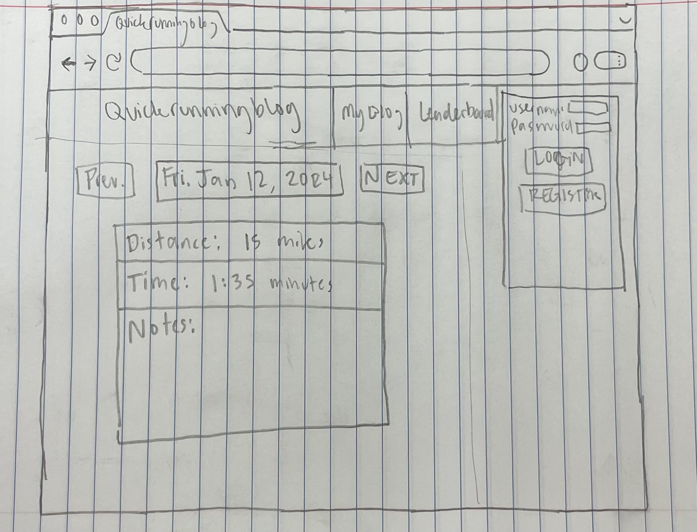

# QuickRunningBlog
## Elevator Pitch
Welcome to QuickRunningBlog – a personalized running journal and leaderboard. Log runs, track your progress, and compete on the live leaderboard.
## Key Features
### Run Logging
- Log your daily runs with details such as distance, time, and personal notes.
- View history of your past runs.
### Leaderboard
- Real-time running leaderboard displays the top runners by distance
## Technology Usage
### Authentication
- Account creation allowing access to personal run history and notes
### Database Data
- Runs will be stored in the database connected to a unique user
### WebSocket Data
- Realtime leaderboard updates. Currently thinking by rolling distance run for the current week
## Mock:

## HTML deliverable:
I laid out the basic structure of the blog with this deliverable. 
### Application data:
    This is the blog body, with an entry for individual blog posts that will be queried from the database using the user's login credentials. Note the display of the user's name
### Authentication:
    UN/PW
### Database data:
    Mentioned above, the DB data is the individual's blog posts
### WebSocket data: 
    The leaderboards will be updated live when someone posts a new blog post. I added a section for PRs, this would increase the scope to having to set a 'race report' flag for each blog post

## CSS deliverable:
    I learned an enormous amount about css and flex-box doing this deliverable
### Header, footer, and main content body
    I had to go through a couple of iterations to get the header main and footer to behave how I wanted. I learned about creating patterns and gradients for the main background of the application and styling different components with gradients.
### Navigation elements
    I added some nice styles to my nav bar. I have my logo and nav items persist on all screens. I also added some nice little animations to my nav items by adjusting their size and color on hover.
### Responsive to window resizing
    Flexbox is amazing! As long as I properly set up my elemets in their containers and enabled flex there was very little effort in this section.
### Application elements
    It was of very little use creating my HTML skeletons for the last deliverable because the styling that I ended up going with informed the HTML layout. I now have a login page, the page a user will see when they are already logged in, a My Blog page containing your history of runs, the weekly leaderboard and an about page. The blog page was the most complicated as it includes a date navigator, a blog info section and the main blog content section. Each individual blog entry includes date, location, a title and description as well as duration, pace, and distance information.
### Application text content
    I generated some dummy data for my blog bio, posts and leaderboard rankings for the week
### Application images
    I don't think I'll keep the image on the about page in this same state forever, but it sure looks nice now!

## Javascript deliverable:
### Login Support
    I'm currently saving usernames and passwords in localStorage. I display them on the welcome screen as well as attach the username to run records to segment each user's blog and properly credit each runner for their performance on the leaderboard
### Future database data
    I made a RunRecord class that has all the fields I need to populate a user's blog entries. I get this information on the Record screen and display it on each user's blog as well as the leaderboard. I implemented a month segmentation feature on the blog page, so you can browse through your runs per-month and see them from most to least recent. I currently have the blog info as editable fields on the user's page but I'll probably make a user record with that information when I'm more clear on how the database phase works.
### Future Websocket Support
    I implemented the longest distance ran leaderboard by pulling all the run records I have, ordering them, and populating a table with them. In the future they will populate and reorder live
### General support for logic
    The main interaction in this application is creating a run and then seeing placed in the proper place on your blog. This is essentially done and works very nicely. The other interesting thing that I implemented was attaching the user to the run record so I can do interesting things with the data on the leaderboard page.

## Web Services deliverable:
### Endpoints
    
    This ended up being relatively quick and easy as I just had to swap out my RunRecordDAO objects for http fetches. Specifically I implemented a get all runs endpoint and a create new run endpoint. Getting all the runs just consists of returning the allRunRecords array I have in my server's memory. Posting a run I also decided to implement the sorting on the server side rather than the client side.
### Blog Support
    After spending an infuriating amount of time fixing a bug caused by timezones, I swapped out my calls to getAllRuns to hitting my get runs endpoint and it was as simple as that.
### Leaderboard Support
    The leaderboard uses the same logic as the blog without segregating based on user. I can't really impliment the weekly mileage leader yet without having a better way to test and think about users but swapping out for my get runs endpoint was also quick and easy.
### Third Party API call
    I tacked on an api call to the quotable random quote endpoint and stuck that in my about page.
